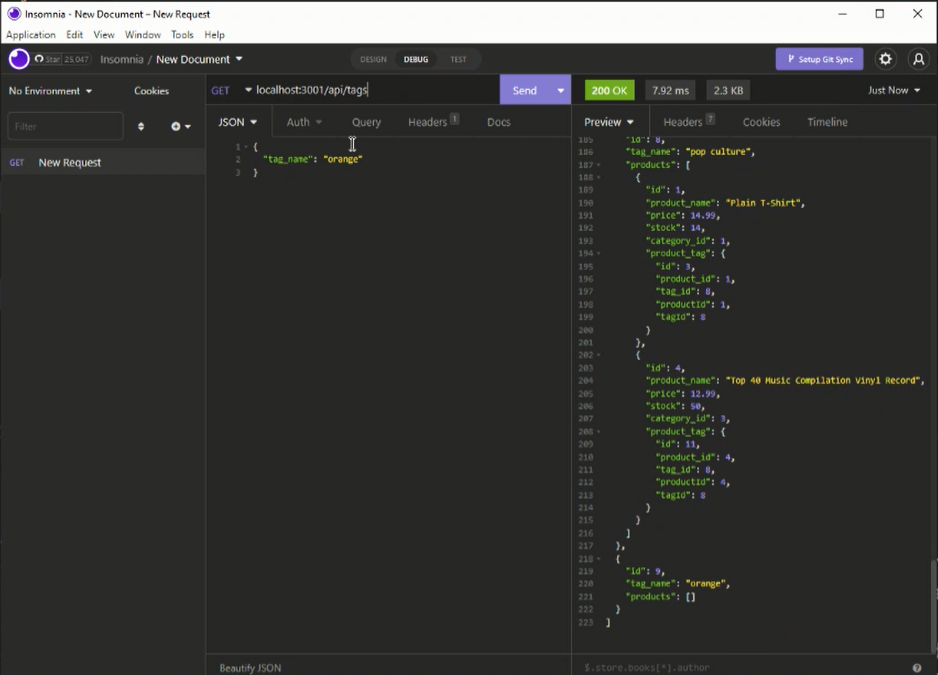

# E-commerce Back End Starter Code

# User Story
    AS A manager at an internet retail company
I WANT a back end for my e-commerce website that uses the latest technologies
SO THAT my company can compete with other e-commerce companies

  ## Table of Contents
  * [Description](#description)
  * [Usage](#usefaq)
  * [Installation](#install)
  * [Run](#run)
  * [Dependencies](#dependencies)
  * [Technology Used](#techno)
  * [Demo](#demo)
  * [Testing](#test)
  * [License](#license)
  * [Contributing to this Repo](#contributing)
  * [Questions / Contact Details](#questions)
  
  
  ## Description
  This application takes a working Express.js API and configures it to use Sequelize to interact with a MYSQL database.
  This is an Object Relational Mapping (ORM) E-commerce Back End.  It is run through a command line application and viewed using Insomnia Core.

  
  ## Usage
  This is a back end application to connet to MSQL database.  It uses Insomnia to view the CRUD operations in the database.

  
  ## Installation   
    Please use npm 
  * npm i - to install all files and dependencies OR
  * npm init to create a json file,  
  * npm i mysql to connect to MYSQL database, 
  * npm i sequelize 
  * npm i dotenv
  
  
  ## Run
  npm start

  
  ## Dependencies
    * "dotenv": "^16.0.3",
    * "express": "^4.18.2",
    * "mysql": "^2.18.1",
    * "mysql2": "^2.3.3",
    * "sequelize": "^5.21.7"

    
  
  ## Technologies Used
  * Javascript
  * Node.js
  * MYSQL  
  * Sequelize
  * Insomnia

  ## Demo
  

  To watch the application in action, click [here](https://www.youtube.com/embed/Fn3TJaxQDrA)

  
  ## Testing
  n/a

  
  ## License
  The application is covered under a MIT license.

  
  ## Contributing to this Repo
  Please [email](smilligan0183@gmail.com) me if you'd like to contribute

  
  ## Questions / Contact Details
  This app can be found on my github page at [Sara-Mill](https://github.com/Sara-Mill).
  

  If you have any questions or need to contact me about this app, I can be reached on [Github](https://github.com/Sara-Mill) or by [email](smilligan0183@gmail.com)